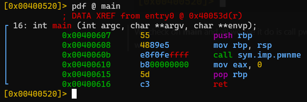

# Write 4 x86_64
https://ropemporium.com/challenge/write4.html

Use **checksec** to see protections on the binary.

Check for strings in the binary now using rabin2 -z ./write4

From the challenge description we know that we need to read "flag.txt" file. We are left without a function that just opens it, no strings to represent the filename and we have a strange library.

As always we know we need to take control of the RIP register and send it somewhere, so time to analyze some functions by using **r2 -A ./write4** to analyze the binary the **-A** is for analyzing on startup. Then run **afl** in order to list functions. 

We check on **main** and all we see it do is call pwnme which is in the library it uses. Using radare2 we analyze that function as well.

Analyze the library the same way and we find the pwnable code. So we use **cyclic** to find the buffer overflow in the read input here. **cyclic 200** generates a 200 char length string. Run ./write4 through gdb and paste the input in and see where it crashes.

The location where $RIP trys to return too is the spot where we overwritten the saved instruction pointer. Copy that and use **cyclic -l 0xADDRESS** to find the offset for you.

Once we learn we need to overflow by 40 bytes. We need to figure where to send $RIP too.

Inspect the print_file function and realize that it loads in a string and trys to open a non existing file based of the string going into $EDI.

Since we cant put the filename on the stack and reference here, we need to find a way to manually write the string into somewhere referenceable.

Since theres no ASLR or PIE we will be using **r2** we can find the mapped memory sections that are readable and writeable for us to place string into. This command "*iS | grep rw*" will show **i**nfo on the mapped **s**ections that will be in memory and read/writeable.

Funny enough the .bss section does not have anything important in it and its size 0x8 is big enough to hold our string.

Now we need to use **ROPgadget** to find some ROP gadgets that can write at least 8 characters to some address. The challenge specifically hints on MOV instructions.
